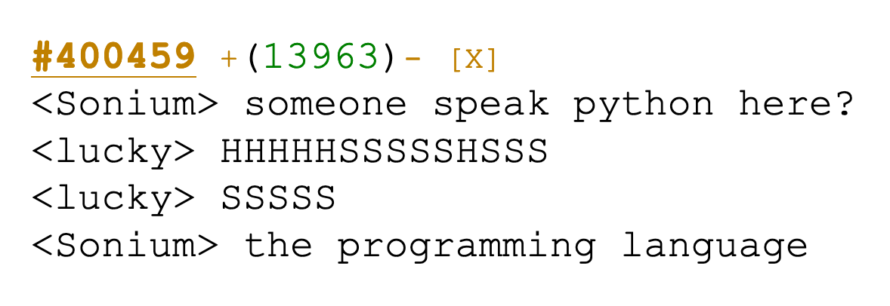

# TruePython
Python as dictated by a python, which is obviously the most pythonic way to code.

Sample input with embedded UTF-8:
```
hIs HISSSS hiS test hiS his
hIs hissss hiS print hiS his
hIs hisssS hiS arg hiS his

hiss HISSSS Hiss hisssS HisS HiSs
  hissss Hiss hisssS HisS
HISSSS Hiss hIS HhIS HIsss HISSS HISSS hiiSs hiSS hiS World! hiS his HisS
```

Sample input without embedded UTF-8:
```
hIs HISSSS hIIS Hiss hIIs hIIS his
hIs hissss hiIS hIiS HIss hiiS hIIS his
hIs hisssS hIss hIiS HiSs his

hiss HISSSS Hiss hisssS HisS HiSs
  hissss Hiss hisssS HisS
HISSSS Hiss hIS HhIS HIsss HISSS HISSS hiiSs hiSS
    hIsSs hiiSs hiIsS HISSS HiSSS hIss his HisS
```

Sample output:
```py


def test  (  arg  )  :
  print  (  arg  )
test  (  "Hello World!"  )
```

Inspiration

